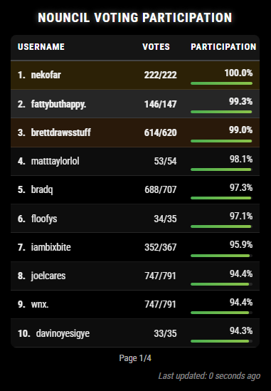

# MMM-NouncilVotes

A MagicMirror module that displays Nouncil voting participation data in a clean, informative interface.



## Features

- Real-time Nouncil voting participation tracking
- Configurable display options
- Pagination and cycling of voter data
- Highlighting of top voters
- Responsive and visually appealing design

## Installation

1. Navigate to your MagicMirror's `modules` directory
2. Clone this repository:
   ```bash
   git clone https://github.com/XppaiCyberr/MMM-NouncilVotes.git
   ```
3. Install dependencies:
   ```bash
   cd MMM-NouncilVotes
   npm install
   ```

## Configuration

Add the module to your `config.js` file:

```javascript
{
    module: 'MMM-NouncilVotes',
    position: 'top_right',
    config: {
        updateInterval: 5 * 60 * 1000, // Update every 5 minutes
        maxEntries: 10, // Number of entries visible at once
        cycleInterval: 15 * 1000, // Cycle through data every 15 seconds
        showTwitter: false, // Show Twitter handles
        showWallet: false, // Show wallet addresses
        minParticipationRate: 0, // Minimum participation rate to show
        highlightTopVoters: true, // Highlight top 3 voters
        animationSpeed: 2000, // Speed of transitions
        showLastUpdated: true // Show when data was last updated
    }
}
```

## Configuration Options

| Option | Description | Default | Type |
|--------|-------------|---------|------|
| `updateInterval` | How often to fetch new data (in milliseconds) | `5 * 60 * 1000` | Number |
| `maxEntries` | Number of entries to display per page | `10` | Number |
| `cycleInterval` | Time between page changes (in milliseconds) | `15 * 1000` | Number |
| `showTwitter` | Display Twitter handles | `false` | Boolean |
| `showWallet` | Display wallet addresses | `false` | Boolean |
| `minParticipationRate` | Minimum participation rate to display (0-100) | `0` | Number |
| `highlightTopVoters` | Highlight top 3 voters | `true` | Boolean |
| `animationSpeed` | Speed of UI transitions (in milliseconds) | `2000` | Number |
| `showLastUpdated` | Show when data was last updated | `true` | Boolean |

## Dependencies

- MagicMirror
- Fetch API support

## API

This module uses the Nouncil API at `https://api.nouncil.wtf` to retrieve voting participation data.

## Contributing

Contributions are welcome! Please submit pull requests or open issues on the GitHub repository.


## Credits

Created by XppaiCyber
